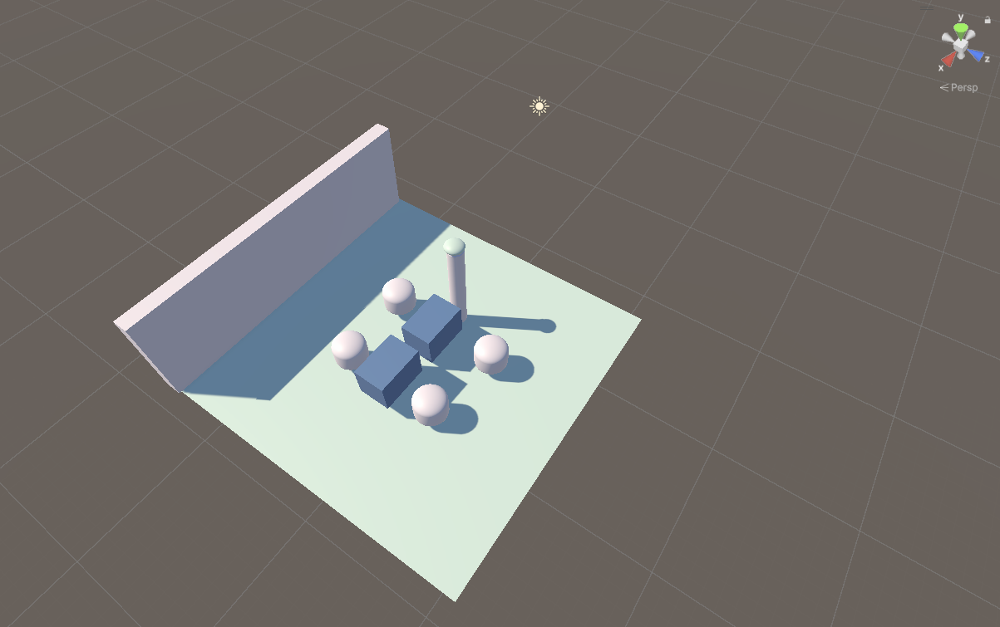

# PRAKTIKUM 02 - Diorama# di Unity 
## Identitas 
Nama  : Annisa Miftahul Jannah
NIM   : 2924001
 Kelas : IF 5A 
 ## Tujuan Menjelaskan tujuan praktikum secara singkat.
 Praktik pembuatan diorama bertujuan untuk memvisualisasikan konsep abstrak—seperti peristiwa sejarah, ekosistem, atau tata ruang—menjadi bentuk miniatur 3D yang nyata dan mudah dipahami. Selain memperkuat pemahaman materi melalui pengalaman belajar langsung (hands-on), praktik ini juga melatih kreativitas, keterampilan motorik halus, serta kepekaan terhadap skala dan proporsi ruang.

 ## Langkah Utama 
1.Buat  Assets/Scenes/Pertemuan02_Diorama.unity
2.Buat Ground dan objek lainnya
3.Susun komposisi
4. Buat Material
5. Atur lighting
6. Tambah Physics
7. Buat Prefab
8. Rapikan Hierarchy
9. Play Test

 ## Hasil Jelaskan fitur yang berhasil dibuat. 
Semua objek saaat di Play Test sudah dapat bergerak
 ## Source Code Utama Nama file: RotateObject.cs 
 ## Bukti  
 ## Pengujian Status: BERHASIL 
 ## Kendala dan Solusi
 ## Kesimpulan